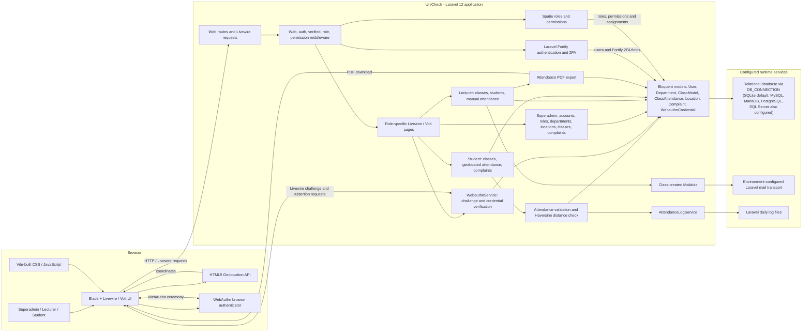

# UniCheck architecture and database ERD

These diagrams document the current repository implementation. The architecture is based on application routes, Livewire/Volt screens, services, and configuration. The ERD reflects the final application schema after the migrations in `database/migrations/`; Laravel's migration repository table is included separately as framework-managed. Features described only as planned in the README are not shown as implemented.

## System architecture

## Database ERD

Solid relationships below represent foreign keys declared in migrations. Spatie's `model_has_roles` and `model_has_permissions` use polymorphic `(model_type, model_id)` assignments; those `model_id` values are intentionally not drawn as foreign keys to `users`. `sessions.user_id` is indexed but is not declared as a foreign key.

```mermaid
erDiagram
    DEPARTMENTS {
        bigint id PK
        string name UK
        string code UK
        text description "nullable"
        boolean is_active
        timestamp created_at
        timestamp updated_at
    }

    USERS {
        bigint id PK
        string name
        string email UK
        timestamp email_verified_at "nullable"
        string password
        string remember_token "nullable"
        string matric_no UK "nullable"
        string avatar "nullable"
        bigint department_id FK "nullable"
        int level "nullable"
        text two_factor_secret "nullable"
        text two_factor_recovery_codes "nullable"
        timestamp two_factor_confirmed_at "nullable"
        timestamp created_at
        timestamp updated_at
    }

    CLASSES {
        bigint id PK
        string title
        text description "nullable"
        bigint lecturer_id FK
        bigint department_id FK
        string level
        decimal latitude
        decimal longitude
        int radius "default 30 meters"
        enum status "active, paused, ended"
        timestamp starts_at
        timestamp ends_at "nullable"
        boolean attendance_open "default true"
        timestamp created_at
        timestamp updated_at
    }

    CLASS_ATTENDANCES {
        bigint id PK
        bigint class_id FK "unique with student_id"
        bigint student_id FK "unique with class_id"
        string full_name
        string matric_number
        decimal latitude
        decimal longitude
        decimal distance
        timestamp marked_at
        boolean marked_by_lecturer
        timestamp created_at
        timestamp updated_at
    }

    LOCATIONS {
        bigint id PK
        decimal latitude
        decimal longitude
        string building_block_name "nullable"
        string location_type
        text description "nullable"
        bigint created_by FK
        timestamp created_at
        timestamp updated_at
    }

    COMPLAINTS {
        bigint id PK
        bigint student_id FK
        string subject
        text message
        enum status
        enum priority
        text admin_response "nullable"
        bigint responded_by FK "nullable"
        timestamp responded_at "nullable"
        timestamp created_at
        timestamp updated_at
    }

    WEBAUTHN_CREDENTIALS {
        bigint id PK
        bigint user_id FK
        string credential_id UK
        text public_key
        string authenticator_type "nullable"
        boolean is_resident_key
        string device_name "nullable"
        bigint signature_count
        timestamp last_used_at "nullable"
        timestamp created_at
        timestamp updated_at
    }

    ROLES {
        bigint id PK
        string name
        string guard_name
        timestamp created_at
        timestamp updated_at
    }

    PERMISSIONS {
        bigint id PK
        string name
        string guard_name
        timestamp created_at
        timestamp updated_at
    }

    MODEL_HAS_ROLES {
        bigint role_id PK, FK
        bigint model_id PK
        string model_type PK
    }

    MODEL_HAS_PERMISSIONS {
        bigint permission_id PK, FK
        bigint model_id PK
        string model_type PK
    }

    ROLE_HAS_PERMISSIONS {
        bigint permission_id PK, FK
        bigint role_id PK, FK
    }

    PASSWORD_RESET_TOKENS {
        string email PK
        string token
        timestamp created_at "nullable"
    }

    SESSIONS {
        string id PK
        bigint user_id "nullable, indexed; no FK"
        string ip_address "nullable"
        text user_agent "nullable"
        longtext payload
        int last_activity
    }

    CACHE {
        string key PK
        mediumtext value
        int expiration
    }

    CACHE_LOCKS {
        string key PK
        string owner
        int expiration
    }

    JOBS {
        bigint id PK
        string queue "indexed"
        longtext payload
        tinyint attempts
        int reserved_at "nullable"
        int available_at
        int created_at
    }

    JOB_BATCHES {
        string id PK
        string name
        int total_jobs
        int pending_jobs
        int failed_jobs
        longtext failed_job_ids
        mediumtext options "nullable"
        int cancelled_at "nullable"
        int created_at
        int finished_at "nullable"
    }

    FAILED_JOBS {
        bigint id PK
        string uuid UK
        text connection
        text queue
        longtext payload
        longtext exception
        timestamp failed_at
    }

    MIGRATIONS {
        int id PK
        string migration
        int batch
    }

    DEPARTMENTS o|--o{ USERS : "department_id; delete sets null"
    DEPARTMENTS ||--o{ CLASSES : "department_id; delete cascades"
    USERS ||--o{ CLASSES : "lecturer_id; delete cascades"
    CLASSES ||--o{ CLASS_ATTENDANCES : "class_id; delete cascades"
    USERS ||--o{ CLASS_ATTENDANCES : "student_id; delete cascades"
    USERS ||--o{ LOCATIONS : "created_by; delete cascades"
    USERS ||--o{ COMPLAINTS : "student_id; delete cascades"
    USERS o|--o{ COMPLAINTS : "responded_by; delete sets null"
    USERS ||--o{ WEBAUTHN_CREDENTIALS : "user_id; delete cascades"
    ROLES ||--o{ MODEL_HAS_ROLES : "role_id"
    PERMISSIONS ||--o{ MODEL_HAS_PERMISSIONS : "permission_id"
    ROLES ||--o{ ROLE_HAS_PERMISSIONS : "role_id"
    PERMISSIONS ||--o{ ROLE_HAS_PERMISSIONS : "permission_id"
```

### Schema notes

- `class_attendances` enforces one attendance record per class/student pair and has indexes for class/time and student lookups.
- `users.matric_no` and `webauthn_credentials.credential_id` are unique; only `users.matric_no` is nullable.
- Spatie roles and permissions each enforce a composite unique constraint on `(name, guard_name)`.
- `locations.class_name` is not in the final schema; a later migration drops it.
- Laravel's cache, queue, password-reset, session, failed-job, and migration tables are infrastructure tables, not UniCheck domain entities.
- Database field types are shown using concise migration-level names; exact SQL type mappings vary by configured database driver.
- The architecture shows the browser geolocation and biometric attendance flow, class-created email notification, and DomPDF attendance report export present in the code. It does not claim map visualization, attendance OTP, or offline sync are implemented.
